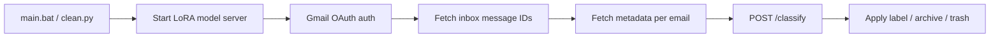

# EmailCDI — AI Gmail Inbox Cleaner

An interactive Gmail inbox cleaner that classifies emails with a locally hosted, LoRA fine-tuned **Qwen3-4B** model and applies labels, archives, or trash actions based on configurable rules.

Built by **TreyLog**. Gmail only.

---

## About

**emailCDI** (CDI Email Cleaner) connects to your Gmail account, fetches inbox messages, and sends each email’s metadata (sender, subject, snippet, labels) to a local FastAPI model server. The model returns a category and reason. The cleaner looks up the action for that category in `config/rules.json`—labeling, archiving, starring, or trashing as configured.

All inference runs on your machine. The base model weights are downloaded from Hugging Face on first run. The project-specific LoRA adapter lives in `core/qwen-email-cleaner-lora-v01/` and is stored in this repository with **Git LFS** (large weight files are not stored as regular Git blobs).

**Disclaimer:** This tool can modify your Gmail inbox. Use at your own risk. Review your rules and start in dry-run mode before enabling destructive actions.

---

## Features

- **Local AI classification** — Qwen3-4B + LoRA adapter (`qwen-email-cleaner-lora-v01`), served via FastAPI on `127.0.0.1:8008`
- **18 email categories** — Promotional, Banking, Security, Personal, and more (see [Configuration](#configuration))
- **Configurable actions per category** — `TRASH`, `KEEP`, `IMPORTANT`, `REVIEW_DELETE`, `UNSURE`
- **Dry run vs full run** — Label-only mode for safe testing; run mode applies real archive/trash behavior
- **Confidence-gated trash** — Emails are only moved to Trash when confidence ≥ 0.90 in run mode; lower-confidence trash suggestions get a `review_delete` label instead
- **Interactive CLI** — Rich progress bars, Questionary menus, ASCII banner
- **Gmail rate-limit handling** — Adaptive throttling and retries for API calls
- **In-app rule editing** — Change category actions and switch modes from the main menu

---

## How It Works



### Pipeline

1. **Launch** — `main.bat` (or `python clean.py` from `core/`) starts the CLI and spawns `lora_model_server.py` in the background.
2. **Model warmup** — The server loads `Qwen/Qwen3-4B` in 4-bit quantization and attaches the local LoRA adapter. Health is polled at `GET http://127.0.0.1:8008/health` until status is `ok` (up to ~3 minutes).
3. **Authentication** — OAuth 2.0 via `client_secret.json`; tokens cached in `token.json`. Scope: `gmail.modify`.
4. **Fetch emails** — Lists Gmail message IDs, then batch-fetches metadata (From, Subject, Date, snippet, label IDs).
5. **Classify** — Each email is sent to `POST http://127.0.0.1:8008/classify` with sender, subject, snippet, labels, and the category list from `config/rules.json`.
6. **Apply actions** — Based on the category from the model and the matching rule in `config/rules.json`, plus the current rule mode (`dry run` or `run`):
   - **TRASH** — Move to Trash (run mode)
   - **KEEP** — Apply category label; star if `important: true`; archive in run mode
   - **ARCHIVE** — Label `scaned` and archive in run mode
   - **REVIEW_DELETE / UNSURE** — Apply review labels; archive in run mode
   - **Dry run** — Labels only; never trashes or removes from inbox

---

## Project Structure

```
emailCDI/
├── main.bat                          # Windows launcher (runs clean.py)
├── requirements.txt                  # Python dependencies (CUDA 12.1 PyTorch)
├── README.md
├── config/
│   └── rules.json                    # Categories, actions, dry run / run mode
└── core/
    ├── clean.py                      # Gmail client + CLI orchestration
    ├── lora_model_server.py          # Local Qwen LoRA inference server
    ├── client_secret.json            # Google OAuth client credentials (you provide)
    ├── token.json                    # Cached OAuth token (auto-generated)
    └── qwen-email-cleaner-lora-v01/  # LoRA adapter (Git LFS)
        ├── adapter_config.json
        ├── adapter_model.safetensors # LFS (~126 MB)
        ├── tokenizer.json            # LFS
        ├── tokenizer_config.json
        └── chat_template.jinja
```

### Key Files

| File | Role |
|------|------|
| `core/clean.py` | Gmail auth, inbox fetch, classification loop, action application, interactive menu |
| `core/lora_model_server.py` | Loads Qwen3-4B + LoRA; exposes `/health` and `/classify` |
| `config/rules.json` | Category definitions, per-category default actions, global `rule` mode |
| `core/qwen-email-cleaner-lora-v01/` | LoRA adapter trained on top of `Qwen/Qwen3-4B` |
| `core/client_secret.json` | Google Cloud OAuth 2.0 Desktop client secret |
| `core/token.json` | Saved user credentials after first sign-in |

---

## Setup

### Prerequisites

- **Windows** (project uses `main.bat` and `py -3.11`)
- **Python 3.11**
- **Git LFS** — required to download LoRA weight files from the repo
- **NVIDIA GPU with CUDA 12.1** — required by the model server (`torch.cuda.is_available()`)
- **Google Cloud project** with Gmail API enabled and OAuth 2.0 Desktop credentials
- **Hugging Face access** — base model `Qwen/Qwen3-4B` is downloaded on first server start

### 1. Clone with Git LFS

Install [Git LFS](https://git-lfs.com/) once on your machine, then clone and pull adapter weights:

```powershell
git lfs install
git clone https://github.com/treylog1/Email-cleaner.git emailCDI
cd emailCDI
git lfs pull
```

If you already cloned without LFS, fetch the weight files with:

```powershell
git lfs install
git lfs pull
```

LFS-tracked files in this repo:

| Pattern | Files |
|---------|--------|
| `*.safetensors` | LoRA adapter weights |
| `core/**/tokenizer.json` | Tokenizer vocabulary |
| `*.pt`, `*.pth` | Other weight files (if present) |

Verify the adapter is present after pull:

```powershell
dir core\qwen-email-cleaner-lora-v01\adapter_model.safetensors
```

The file should be ~126 MB, not a tiny LFS pointer text file.

### 2. Install Python dependencies

```powershell
py -3.11 -m pip install -r requirements.txt
```

PyTorch is pinned to CUDA 12.1 wheels via `--extra-index-url` in `requirements.txt`.

### 3. Google OAuth credentials

1. Create a project in [Google Cloud Console](https://console.cloud.google.com/).
2. Enable the **Gmail API**.
3. Create **OAuth 2.0 Client ID** credentials (Desktop app).
4. Download the JSON and save it as:

   ```
   core/client_secret.json
   ```

5. On first **Sign in**, a browser window opens for consent. The resulting token is written to `core/token.json`.

**Keep both files private.** Do not commit them to version control.

### 4. Update `main.bat` (if needed)

The launcher currently `cd`s to a fixed path:

```bat
cd /d "C:\Users\treyl\Desktop\emailCDI\core"
py -3.11 clean.py
```

Change this path if your project lives elsewhere.

### 5. Verify GPU / model server (optional)

From `core/`:

```powershell
py -3.11 lora_model_server.py
```

Wait for `Model loaded.` then visit `http://127.0.0.1:8008/health`. You should see `"status": "ok"`.

---

## Usage

### Start the app

Double-click `main.bat`, or from `core/`:

```powershell
py -3.11 clean.py
```

The CLI shows an ASCII banner and menu:

| Menu option | Description |
|-------------|-------------|
| **Sign in** | Authenticate with Gmail and print your email address |
| **Start Clean** | Wait for model server, fetch inbox, classify, apply actions |
| **Check Model** | Poll model server health (`ok` / `loading`) |
| **Change Rules** | Edit a category’s default action in `config/rules.json` |
| **Switch Label/Action Mode** | Toggle between dry run (labels only) and full run |
| **Quit** | Stop the model server subprocess and exit |

### Recommended first run

1. Choose **Switch Label/Action Mode** → **Label Only (Dry Run)**.
2. **Sign in** to authorize Gmail.
3. **Start Clean** and review labels applied to your messages.
4. When satisfied, switch to **Full Actions (Run)** for real archive/trash behavior.

---

## Configuration

Rules live in **`config/rules.json`**. The cleaner reads this path relative to `core/clean.py`:

```json
{
  "version": 2,
  "rule": "run",
  "categories": [ ... ]
}
```

### Global mode: `rule`

| Value | Behavior |
|-------|----------|
| `"dry run"` | Labels only — no trash, no inbox removal |
| `"run"` | Full actions — archive, trash (when confidence allows), star |

Default in the repo: `"run"`. Use `"dry run"` for safe testing.

### Categories

Each category has:

- **`name`** — Label name and model output category (must match exactly)
- **`action`** — Default action: `TRASH`, `KEEP`, `IMPORTANT`, `REVIEW_DELETE`, or `UNSURE`
- **`description`** — Shown to the model in the classification prompt

Current categories:

| Category | Default action | Summary |
|----------|----------------|---------|
| Promotional | TRASH | Sales, marketing, coupons |
| SocialMedia | TRASH | Facebook, X, LinkedIn, etc. |
| SpamOrPhishing | TRASH | Scams, bulk spam |
| LowValueNotification | TRASH | Low-value app pings |
| Newsletter | TRASH | Newsletters, digests |
| AccountUpdate | KEEP | Account/settings changes |
| EventReminder | REVIEW_DELETE | Calendar, RSVPs, webinars |
| Banking | IMPORTANT | Bank statements, transfers |
| Bills | IMPORTANT | Utilities, rent, renewals |
| Security | IMPORTANT | 2FA, password resets |
| Shipping | KEEP | Tracking, delivery |
| Receipt | KEEP | Order confirmations |
| School | KEEP | University correspondence |
| Job | IMPORTANT | Recruiting, interviews |
| Work | KEEP | Business email |
| Personal | KEEP | Friends, family |
| MedicalInsuranceLegal | IMPORTANT | Medical, legal, insurance |
| Unknown | UNSURE | Needs manual review |

### Confidence thresholds

The model is prompted to calibrate confidence (0–1). The cleaner enforces one hard gate:

- **`TRASH` in run mode** — Only trashes when `confidence >= 0.90`. Otherwise applies the `review_delete` label and archives.

Other actions in run mode archive the message (remove `INBOX`) after labeling, except in dry run mode where inbox state is unchanged.

### Gmail labels created at runtime

- Category name labels (e.g. `Promotional`, `Banking`)
- `review_delete` — flagged for manual triage
- `scaned` — applied for archive-style actions in dry run
- `Unsure` — low-confidence / unknown classifications

---

## Model Server API

**Base URL:** `http://127.0.0.1:8008`

### `GET /health`

Returns load status, base model name, adapter path, and GPU info.

### `POST /classify`

Request body (email fields + categories from rules):

```json
{
  "sender": "Example <user@example.com>",
  "sender_domain": "example.com",
  "subject": "Your order shipped",
  "snippet": "Track your package...",
  "gmail_labels": ["INBOX", "UNREAD"],
  "has_attachments": false,
  "attachment_count": 0,
  "categories": [ ... ]
}
```

Response:

```json
{
  "category": "Shipping",
  "confidence": 0.95,
  "reason": "Shipping notification with tracking language.",
  "action": "KEEP",
  "raw_output": "..."
}
```

**Model details:**

- Base: `Qwen/Qwen3-4B` (4-bit NF4 via bitsandbytes)
- Adapter: `core/qwen-email-cleaner-lora-v01/` (local only)
- Generation: `max_new_tokens=256`, `temperature=0.1`

---

## Dependencies

From `requirements.txt`:

| Package | Purpose |
|---------|---------|
| `torch` / `torchvision` / `torchaudio` (cu121) | GPU inference |
| `transformers`, `peft`, `accelerate`, `bitsandbytes`, `safetensors` | Model loading & LoRA |
| `fastapi`, `uvicorn`, `pydantic` | Model server |
| `google-api-python-client`, `google-auth`, `google-auth-oauthlib` | Gmail API |
| `requests` | HTTP client (classify + health) |
| `questionary`, `rich`, `art` | CLI UX |

---

## Secrets & Sensitive Files

| File | Description |
|------|-------------|
| `core/client_secret.json` | Google OAuth client secret — **required before first run** |
| `core/token.json` | OAuth refresh/access token — created after sign-in |

Treat both as secrets. Regenerate or revoke in Google Cloud Console if exposed.

---

## Troubleshooting

| Issue | What to check |
|-------|----------------|
| Model server never ready | CUDA available? Run `lora_model_server.py` manually and read stderr |
| `CUDA is not available` | Install CUDA 12.1 drivers; reinstall PyTorch cu121 wheels |
| Gmail auth fails | `client_secret.json` present in `core/`; Gmail API enabled |
| No emails fetched | Signed in? Inbox has messages? Check console for API errors |
| Trash not happening | Run mode enabled? Confidence below 0.90 routes to `review_delete` instead |
| Hugging Face download errors | Network access; accept model license on Hugging Face if required |
| LoRA adapter missing or tiny file | Run `git lfs install` then `git lfs pull`; enable LFS on your Git host |
| `git lfs pull` fails | GitHub LFS bandwidth/storage quota; check repo LFS settings |

---

## Git LFS (model weights)

This repo uses **Git LFS** for large model files under `core/qwen-email-cleaner-lora-v01/`. Without LFS, you only get pointer stubs and the model server will fail to load the adapter.

**Contributors:** after adding or changing LFS-tracked files:

```powershell
git lfs install
git add path\to\file.safetensors
git commit -m "Update adapter weights"
git push
```

**GitHub:** ensure [Git LFS is enabled](https://docs.github.com/en/repositories/working-with-files/managing-large-files) on the repository. LFS objects count toward storage/bandwidth limits on free plans.

---

## License

See individual component licenses (Qwen, PEFT/TRL, Google APIs). LoRA adapter metadata references TRL and PEFT training frameworks.
